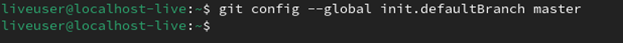

---
## Front matter
title: "Отчёт по лабораторной работе 2"
subtitle: "дисциплина: Архитектура компьютеров"
author: "Грачев Я. М. НПИбд-01-24"

## Generic otions
lang: ru-RU
toc-title: "Содержание"

## Bibliography
bibliography: bib/cite.bib
csl: pandoc/csl/gost-r-7-0-5-2008-numeric.csl

## Pdf output format
toc: true # Table of contents
toc-depth: 2
lof: true # List of figures
lot: true # List of tables
fontsize: 12pt
linestretch: 1.5
papersize: a4
documentclass: scrreprt
## I18n polyglossia
polyglossia-lang:
  name: russian
  options:
	- spelling=modern
	- babelshorthands=true
polyglossia-otherlangs:
  name: english
## I18n babel
babel-lang: russian
babel-otherlangs: english
## Fonts
mainfont: PT Serif
romanfont: PT Serif
sansfont: PT Sans
monofont: PT Mono
mainfontoptions: Ligatures=TeX
romanfontoptions: Ligatures=TeX
sansfontoptions: Ligatures=TeX,Scale=MatchLowercase
monofontoptions: Scale=MatchLowercase,Scale=0.9
## Biblatex
biblatex: true
biblio-style: "gost-numeric"
biblatexoptions:
  - parentracker=true
  - backend=biber
  - hyperref=auto
  - language=auto
  - autolang=other*
  - citestyle=gost-numeric
## Pandoc-crossref LaTeX customization
figureTitle: "Рис."
tableTitle: "Таблица"
listingTitle: "Листинг"
lofTitle: "Список иллюстраций"
lotTitle: "Список таблиц"
lolTitle: "Листинги"
## Misc options
indent: true
header-includes:
  - \usepackage{indentfirst}
  - \usepackage{float} # keep figures where there are in the text
  - \floatplacement{figure}{H} # keep figures where there are in the text
---

# Цель работы

Ознакомиться с системой контроля версий Git, настроить его, завести репозиторий на сайте github и скинуть в него свои отчеты по лабораторным работам.

# Выполнение лабораторной работы

## Базовая настройка git

Делаем предварительную конфигурацию git. (рис. [-@fig:001])

{ #fig:001 width=70%, height=70% }

Настраиваем utf-8 в выводе сообщения git. (рис. [-@fig:002])

{ #fig:002 width=70%, height=70% }

Задаём имя начальной ветки. (рис. [-@fig:003])

{ #fig:003 width=70%, height=70% }

{ #fig:004 width=70%, height=70% }

{ #fig:005 width=70%, height=70% }

## Создание SSH ключа.

{ #fig:006 width=70%, height=70% }

{ #fig:007 width=70%, height=70% }

Заходим в свой аккаунт на сайте github. 
Переходим в настройки.(рис. [-@fig:008]])

{ #fig:008 width=70%, height=70% }

{ #fig:009 width=70%, height=70% }

## Создание рабочего пространства и репозитория курса на основе шаблона.

Открываем терминал

{ #fig:010 width=70%, height=70% }

## Создание репозитория курса

Переходим на страницу репозитория с шаблоном.

{ #fig:011 width=70%, height=70% }

Открываем терминал.

{ #fig:012 width=70%, height=70% }

{ #fig:013 width=70%, height=70% }

## Настройка каталога курса

{ #fig:014 width=70%, height=70% }

{ #fig:015 width=70%, height=70% }

{ #fig:016 width=70%, height=70% }

{ #fig:017 width=70%, height=70% }

{ #fig:018 width=70%, height=70% }

{ #fig:019 width=70%, height=70% }

{ #fig:020 width=70%, height=70% }

# Выводы

Мы познакомились с системой контроля git, выучили команды для работы с ним, создали свой репозиторий на платформе github, где в последствии будут храниться все будущие отчёты по лабораторным работам.а также приобрела практические навыки по работе с системой git.